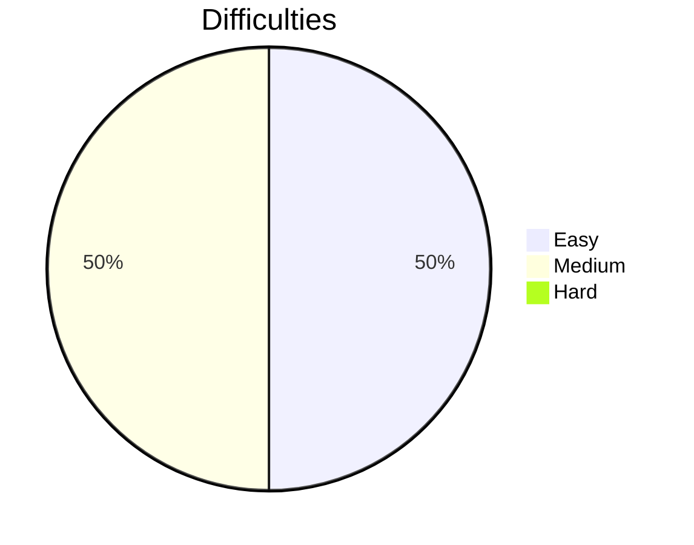

# Leetcode-Solutions

Neetcode 150: [Link](https://neetcode.io/practice)

| Day             | Problem                                                        | Solution Location |
| --------------- | -------------------------------------------------------------- | ----------------- |
| May 17th, 2023  | [p217](https://leetcode.com/problems/contains-duplicate/)      | Array & Hashing   |
| May 17th, 2023  | [p242](https://leetcode.com/problems/valid-anagram/)           | Array & Hashing   |
| May 20th, 2023  | [p1](https://leetcode.com/problems/two-sum/)                   | Array & Hashing   |
| May 22th, 2023  | [p49](https://leetcode.com/problems/group-anagrams/)           | Array & Hashing   |
| May 23th, 2023  | [p347](https://leetcode.com/problems/top-k-frequent-elements/) | Array & Hashing   |
| July 02th, 2023 | [p36](https://leetcode.com/problems/valid-sudoku/)             | Array & Hashing   |

