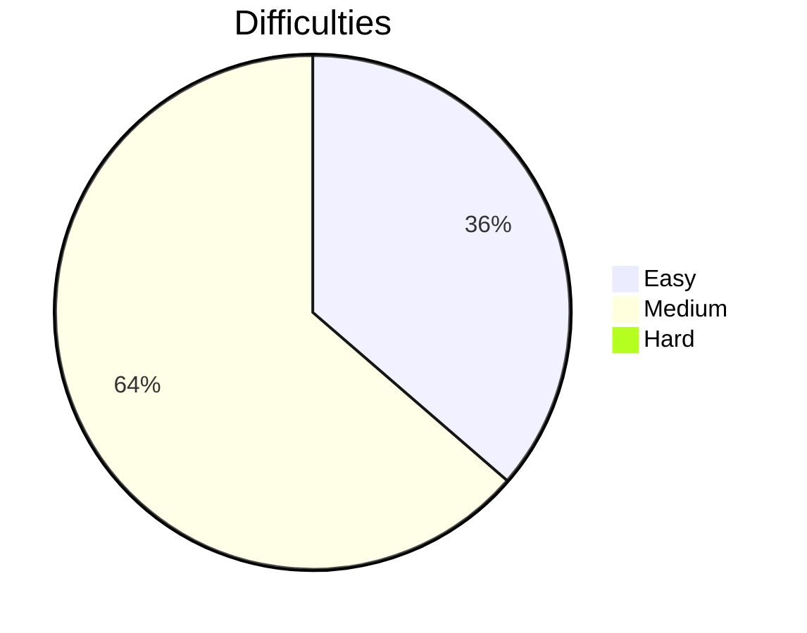

# Leetcode-Solutions

Neetcode 150: [Link](https://neetcode.io/practice)

| Day               | Problem                                                                 | Solution Location |
| ----------------- | ----------------------------------------------------------------------- | ----------------- |
| May 17th, 2023    | [p217](https://leetcode.com/problems/contains-duplicate/)               | Array & Hashing   |
| May 17th, 2023    | [p242](https://leetcode.com/problems/valid-anagram/)                    | Array & Hashing   |
| May 20th, 2023    | [p1](https://leetcode.com/problems/two-sum/)                            | Array & Hashing   |
| May 22th, 2023    | [p49](https://leetcode.com/problems/group-anagrams/)                    | Array & Hashing   |
| May 23th, 2023    | [p347](https://leetcode.com/problems/top-k-frequent-elements/)          | Array & Hashing   |
| July 02nd, 2023   | [p36](https://leetcode.com/problems/valid-sudoku/)                      | Array & Hashing   |
| August 05th, 2023 | [p128](https://leetcode.com/problems/longest-consecutive-sequence/)     | Array & Hashing   |
| August 05th, 2023 | [p125](https://leetcode.com/problems/valid-palindrome/solutions)        | Two Pointer       |
| Augest 06th, 2023 | [p167](https://leetcode.com/problems/two-sum-ii-input-array-is-sorted/) | Two Pointer       |
| August 06th, 2023 | [p15](https://leetcode.com/problems/3sum)                               | Two Pointer       |
| August 06th, 2023 | [p11](https://leetcode.com/problems/container-with-most-water/)         | Two Pointer       | 

